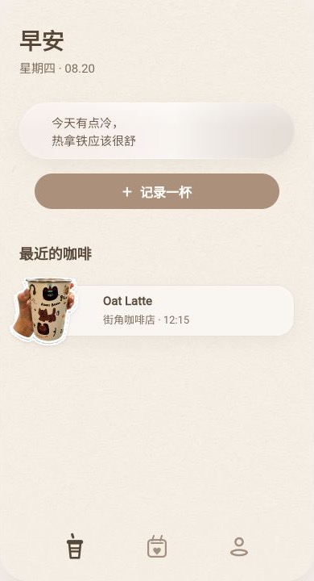
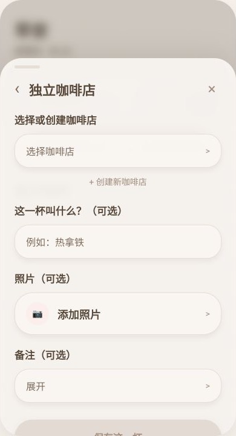
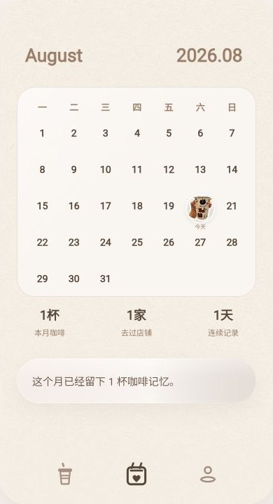
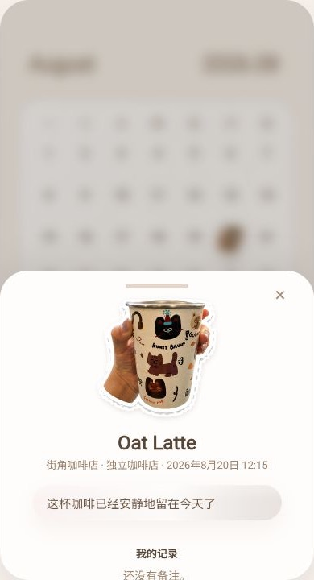
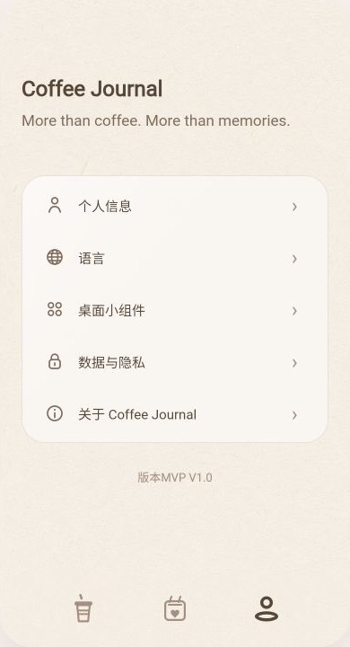

# Coffee Journal

Coffee Journal 是一款以咖啡为入口的 AI 日记 App MVP。

它不是咖啡摄入量追踪器，而是帮助用户快速记录一杯咖啡，并在之后通过月历和 Coffee Memory 回看日常记忆的移动端产品。

> More than coffee. More than memories.

## Demo

- 当前状态：Flutter 移动端 MVP / Portfolio-ready prototype
- 本地预览：`flutter run -d web-server --web-hostname 127.0.0.1 --web-port 5180`

| Home | Record Flow | Journal |
|---|---|---|
|  |  |  |
| 今日问候、AI 提示、记录入口和最近咖啡 | 选择来源、补充饮品信息并保存记录 | 用月历和咖啡贴纸回看本月记录 |

| Coffee Memory | Profile |
|---|---|
|  |  |
| 查看单杯咖啡的 AI 文案、来源和记录内容 | 个人信息、语言、隐私和 Widget 入口 |

## 项目介绍

Coffee Journal 面向喜欢咖啡、但不想被复杂表单打断的人。

用户可以从 Home 快速记录一杯咖啡，并在 Journal 中通过月历回看每一天的咖啡记忆。这个项目的核心问题是：如何让用户留下一个日常片段，同时不让记录行为变成任务？

产品判断：咖啡只是入口，真正被保存下来的是地点、心情、节奏和生活里的小记忆。AI 不作为聊天机器人出现，而是像轻量观察者一样，为每次记录生成一句温柔的记忆提示。

已完成的 MVP 范围：Home、Record Flow、Journal、Coffee Memory、Profile、iOS Medium Widget prototype，以及本地持久化、相册选择和照片抠图预留管线。

真实拍照入口、生产 AI 接入、云端同步和 App Store 发布准备仍属于后续迭代范围。

## 产品决策

- 不做咖啡参数追踪：MVP 不强制填写烘焙度、咖啡因、冲煮比例等字段，避免把产品变成数据工具。
- 不把 AI 做成独立 Tab：AI 嵌入在用户已有流程中，以一句轻量文案出现。
- Journal 不是数据看板：月历和咖啡贴纸是视觉中心，统计只作为轻量辅助信息。
- Coffee Memory 使用 Bottom Sheet：让回看记忆更像轻量动作，而不是跳转到沉重详情页。
- 保存不依赖 AI 成功：记录保存是核心流程，AI 生成失败时使用兜底文案。

## 我的角色

AI 产品经理 + Flutter MVP Builder

我在这个项目中使用 AI-assisted product workflow 完成从产品定义到可运行原型的完整闭环：

- 定义产品定位和 MVP 边界
- 拆解用户流程和页面结构
- 迭代视觉方向和交互细节
- 使用 Figma 整理核心页面、组件语言和交付结构
- 将设计语言转化为 Flutter 组件和 Theme Token
- 用测试覆盖关键用户路径
- 维护开发日志和交付文档，形成可追踪的项目工作流

## AI 产品经理工作流

我希望通过这个项目展示自己在 AI 产品方向的完整实践能力：从产品定位、用户流程、Figma 设计迭代，到 Flutter 实现、测试验证和 GitHub 交付文档。

## AI Product Thinking

Coffee Journal 的 AI 设计重点不是增加聊天入口，而是把 AI 放在用户已有流程中：保存一杯咖啡后，生成一句短、温柔、低打扰的 Coffee Memory 文案。

AI Message 计划使用来源类型、来源名称、饮品名、备注和记录时间作为输入。输出会随 Coffee Record 固定保存，避免每次打开时重新生成导致记忆内容不稳定。AI 失败时使用兜底文案，不阻塞保存流程。

更完整的工作流说明见：[AI 产品经理工作流](docs/AI_Product_Workflow.md)。

MVP 验收边界见：[MVP Release Checklist](docs/MVP_Release_Checklist.md)。

项目配置、环境变量和本地存储说明见：[Project Config](docs/Project_Config.md)。

## 技术栈

- Flutter / Dart
- Figma
- Riverpod
- GoRouter
- 自定义 Theme Token 与共享 UI 组件
- WidgetKit preview / iOS Extension prototype
- flutter_test

## 技术实现亮点

- 完成 Home → Record Flow → Journal → Coffee Memory 的完整记录闭环，并支持编辑、删除和本地持久化。
- 使用 Riverpod + GoRouter + Feature-first 结构组织 Flutter MVP，配合自定义 Theme Token 还原移动端视觉。
- 预留 AI Message、照片地址、抠图状态等字段，并用 Widget Tests 覆盖核心路径、本地恢复和抠图成功状态。

## 本地运行

```bash
flutter pub get
flutter analyze
flutter test
flutter run
```

如需环境变量：

```bash
cp .env.example .env
```

当前 MVP 不依赖真实 API key，`.env` 可以保持为空。

## 项目状态

Coffee Journal 当前是作品集展示用 MVP 原型，已完成核心体验闭环和主要 UI polish。

当前已验证：

- `flutter analyze`
- `flutter test`

下一步计划：

- 准备 30-60 秒 Demo 录屏
- 接入真实拍照入口和权限失败状态
- 接入保存时 AI Message 生成，并保持失败兜底
- 补充 AI Evaluation 轻量报告
- 验证 iOS Widget 真机体验
- 准备 TestFlight / App Store 发布材料
