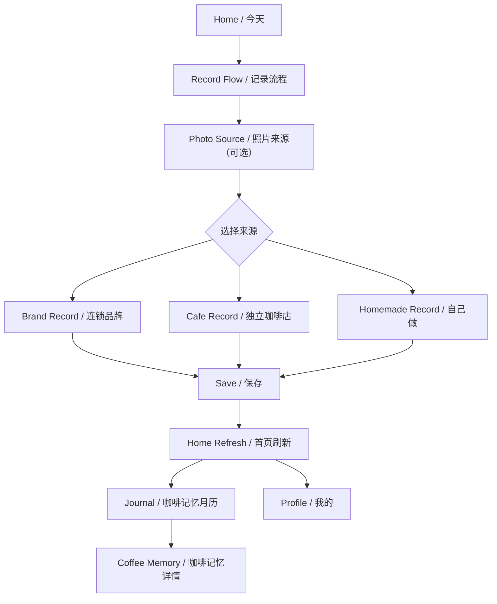

# 03 用户流程

## 主流程

## 流程说明

| 流程 | 说明 | 状态 |
|---|---|---|
| 启动 App | TODO：Splash 未在最终页面清单中确认。 | TODO |
| 首页浏览 | 用户看到问候、日期、Today Card、记录入口、最近的咖啡。 | 已确认 |
| 记录咖啡 | 从 Home 点击 `+ 记录一杯` 进入记录流程。 | 已确认 |
| 选择照片 | 用户可拍照、选照片，也可直接记录。 | 已确认 |
| 选择来源 | 连锁品牌、独立咖啡店、自己做。 | 已确认 |
| 保存记录 | 保存后回到 Home Refresh。 | 已确认 |
| 查看 Journal | 通过底部导航进入 Journal。 | 已确认 |
| 查看 Coffee Memory | 点击 Journal 中的照片缩略图进入 Coffee Memory Bottom Sheet。 | 已确认 |
| 查看 Profile | 通过底部导航进入我的。 | 已确认 |

